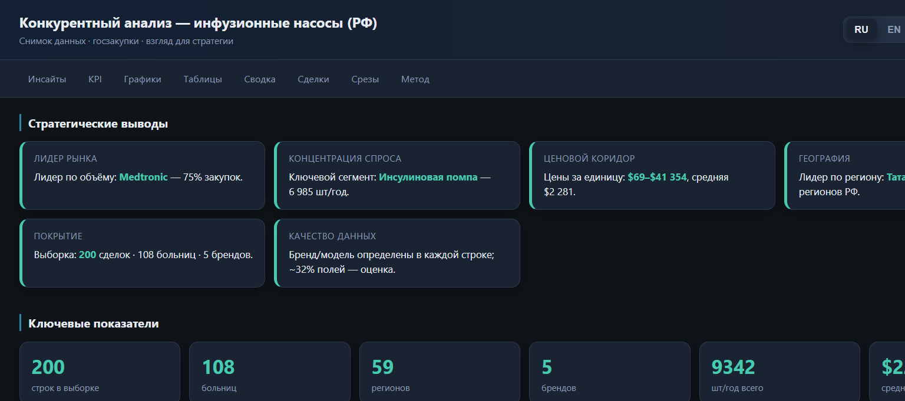

# Infusion Pumps — Market Dashboard

[](https://mary-rnd.github.io/infusion-pumps-dashboard/)
[](https://www.python.org/)
[](#)

**Competitive analysis of infusion pumps (Russian Federation)** — executive dashboard with public procurement data.



## Live

**https://mary-rnd.github.io/infusion-pumps-dashboard/**

Static single-file HTML · no backend · works offline after download.

## What's inside

| Section | Content |
|--------|---------|
| Insights | Market leader, demand concentration, price corridor, geography |
| KPI | 200 deals · 108 hospitals · 59 regions · 5 brands |
| Charts | Brands, applications, price ranges, region heatmap |
| Tables | Top-15 institutions, price corridor by brand |
| Summary | Pivot totals by dimension (brand, region, application…) |
| Deals | Full sample with filters, multi-sort, auction links |
| Slices | SQL analytics: brand×application, region×brand, anomalies… |

### Features

- 🌐 Languages: **RU / EN / ZH**
- 🌗 Themes: dark / light
- ↕️ Multi-column sort (Shift+click)
- 🔍 Search & filter on deal table
- 📊 Interactive charts (Chart.js)
- 🔗 Clickable links to EIS contract cards
- 📱 Responsive layout

## Data snapshot

- Source: [clearspending.ru](https://clearspending.ru) (EIS mirror), free, no API key
- Sample: **200** contract rows, one-shot snapshot (not a live feed)
- Period: 2023–2026 · brands: Medtronic, Fresenius Kabi, B. Braun, Mindray, Aitecs
- Technical specs (ТЗ) not downloaded — `zakupki.gov.ru` unreachable from build node; segment labels are **[HYPOTHESIS]** pending spot-check on 10–20 EIS cards

## Stack

- **Python** — pandas, SQLite pipeline (`collect` → `extract` → `build_db` → `dashboard`)
- **Dashboard** — single HTML template, embedded JSON, vanilla JS + Chart.js CDN
- **Hosting** — GitHub Pages (static)

## Repo layout

```
index.html          # deployed dashboard (this is what Pages serves)
screenshots/        # portfolio screenshots
```

Source pipeline lives in the private working copy; this repo hosts the public demo.

## Update flow

1. Rebuild `output/dashboard.html` locally (`python dashboard.py`)
2. Copy to `index.html`
3. Commit & push → Pages rebuilds automatically (~1 min)

## Notes

- Links to `zakupki.gov.ru` may be geo-blocked outside RF or require ESIA login
- Prices in USD use CB RF rates on contract date
- For internal/portfolio viewing only — not investment advice

---

Made for market strategy review · snapshot data · © analyst
